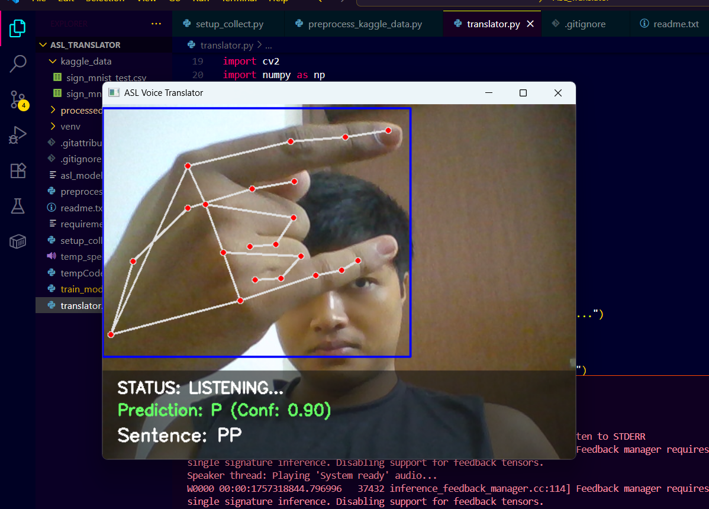

<div align="center">

# 🧠🤟 Sign Language Detector

### *Real-time Sign Language Recognition using Computer Vision & Deep Learning*

[](https://python.org)
[](https://tensorflow.org)
[](https://opencv.org)
[](LICENSE)
[](#)

<br/>



</div>

---

## ✨ Overview

**Sign Language Detector** is a real-time **AI-powered sign language recognition system** built using **Computer Vision and Deep Learning**.  
It detects hand gestures from images or live webcam feeds and translates them into readable text, helping bridge the communication gap between sign language users and non-signers.

---

## 🚀 Key Features

- ✅ Real-time gesture detection using webcam  
- ✅ Static image-based sign recognition  
- ✅ Deep learning (CNN-based) gesture classification  
- ✅ Clean, modular, and extensible codebase  
- ✅ Cross-platform (Windows, macOS, Linux)

---

## 🧠 Tech Stack

| Layer | Technology |
|------|-----------|
| 🐍 Language | Python 3.8+ |
| 👁️ Computer Vision | OpenCV |
| 🤖 Machine Learning | TensorFlow / PyTorch |
| 📊 Data Processing | NumPy |
| 📈 Visualization | Matplotlib |
| 🛠 Environment | venv / Conda |

---

## 📂 Project Structure

```text
sign_lang_detector/
├── a11.png                      # Project screenshot
├── models/                      # Trained model files (.h5 / .pth)
├── data/                        # Dataset & preprocessing data
├── src/
│   ├── detector.py              # Core inference logic
│   ├── camera_input.py          # Webcam handling
│   └── utils.py                 # Helper utilities
├── requirements.txt             # Dependencies
├── README.md
└── LICENSE
⚙️ Installation & Setup
🔹 Prerequisites
Python 3.8+

pip

Webcam (for real-time detection)

🔹 Clone the Repository
bash
Copy code
git clone https://github.com/kh-bikash/sign_lang_detector.git
cd sign_lang_detector
🔹 Create Virtual Environment (Recommended)
bash
Copy code
python -m venv venv

# Windows
venv\Scripts\activate

# macOS / Linux
source venv/bin/activate
🔹 Install Dependencies
bash
Copy code
pip install -r requirements.txt
▶️ Usage
📷 Image-Based Detection
bash
Copy code
python src/detector.py --mode image --input path/to/image.png
🎥 Real-Time Webcam Detection
bash
Copy code
python src/detector.py --mode webcam
🧠 How It Works
Capture image or video frame

Preprocess the hand region

Pass frame to trained deep learning model

Predict sign label

Display output in real time

🧪 Model Training (Optional)
To retrain or improve accuracy:

bash
Copy code
# Preprocess dataset
python preprocess_kaggle_data.py

# Train model
python train_model.py
You can plug in custom datasets to expand supported signs.

🌱 Future Improvements

🔤 Full ASL alphabet support

🧠 Transformer-based gesture recognition

🌐 Web / Mobile deployment

🔊 Text-to-speech output

📱 Accessibility-focused UI

🤝 Contributing

Contributions are welcome!

Fork the repository

Create a new branch

Commit your changes

Open a Pull Request

📜 License

This project is licensed under the MIT License.
Feel free to use, modify, and distribute.

🙌 Acknowledgements

OpenCV Community

Deep Learning research contributors

Open-source datasets
